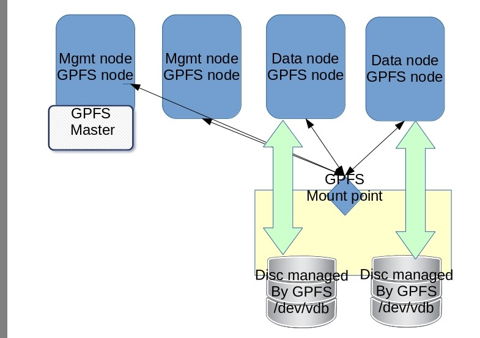

# SpectrumScale/Hortonworks

Create simple HDP + IBM BigSQL + IBM Spectrum Scale cluster on your machine using KVM virtualization.

https://www.ibm.com/support/knowledgecenter/STXKQY_5.0.0/com.ibm.spectrum.scale.v5r00.doc/bl1adv_softinstall_kclanding.htm

Before proceeding you need to have IBM Spectrum Scale local repository with all rpms necessary to run successful installation. More details : https://www.ibm.com/support/knowledgecenter/STXKQY_5.0.0/com.ibm.spectrum.scale.v5r00.doc/bl1adv_localrepo.htm

## Deployment model


## KVM virtual machine

4 KVM machines
* MGM1 : management node + GPFS Master
* MGM2 : management node
* DATA1 : data,compute node + 40 GB disc attached
* DATA2 : data,compute node + 40 GB disc attached

OS: Centos 7.4 Linux

Discs are created by KVM command
```bash
qemu-img create -f qcow2 DISK3.qcow2 40G
```

## Install basic HDP cluster


## Prepare IBM Spectrum Scale and HDFS Transparency dependencies

https://www.ibm.com/developerworks/community/wikis/home?lang=en#!/wiki/General%20Parallel%20File%20System%20(GPFS)/page/2nd%20generation%20HDFS%20Transparency%20Protocol?section=HDFSTransparency2.7.3-x

Download latest HDFS transparency rpm file (part1 and part2). Unpack them and together with IBM Spectrum Scale rpms upload them to the local repository. The repository content should look like:
```
Index of /gpfs_rpms
Parent Directory
gpfs.base-5.0.0-0.x86_64.rpm
gpfs.callhome-ecc-client-5.0.0-0.noarch.rpm
gpfs.compression-5.0.0-0.x86_64.rpm
gpfs.docs-5.0.0-0.noarch.rpm
gpfs.ext-5.0.0-0.x86_64.rpm
gpfs.gpl-5.0.0-0.noarch.rpm
gpfs.gskit-8.0.50-79.x86_64.rpm
gpfs.gui-5.0.0-0.noarch.rpm
gpfs.hdfs-protocol-2.7.3-1.x86_64.rpm
gpfs.hdfs-protocol-2.7.3-2.180202.121800.x86_64.rpm
gpfs.java-5.0.0-0.x86_64.rpm
gpfs.license.std-5.0.0-0.x86_64.rpm
gpfs.msg.en_US-5.0.0-0.noarch.rpm
repodata/
rhel7/
sles12/
```
## Download and unpack IBM Spectrum Scale Ambari management pack for HDP

https://www.ibm.com/developerworks/community/wikis/home?lang=en#!/wiki/General%20Parallel%20File%20System%20(GPFS)/page/BI%204.2.5%20and%20HDP%202.6

Copy the file to the host where Ambari server is installed and unpacked it.
```
tar xvfz ../SpectrumScaleMPack-2.4.2.4.180131.120413.noarch.tar.gz 

./SpectrumScaleIntegrationPackageInstaller-2.4.2.4.bin
./SpectrumScaleMPackInstaller.py
./SpectrumScaleMPackUninstaller.py
./SpectrumScale_UpgradeIntegrationPackage
./sum.txt
```
## Install IBM Spectrum Scale Ambari management pack

Make sure that Ambari server is running.
```
ambari-server status

Using python  /usr/bin/python
Ambari-server status
Ambari Server running
Found Ambari Server PID: 1307 at: /var/run/ambari-server/ambari-server.pid
```
Install management pack.
```
./SpectrumScaleIntegrationPackageInstaller-2.4.2.4.bin 

Do you agree to the above license terms? [yes or no] 
yes
Installing...
INFO: ***Starting the Mpack Installer***   

Enter Ambari Server Port Number. If it is not entered, the installer will take default port 8080  :   
INFO: Taking default port 8080 as Ambari Server Port Number.
Enter Ambari Server IP Address. Default=127.0.0.1  :   
INFO: Ambari Server IP Address not provided. Taking default Amabri Server IP Address as "127.0.0.1".
Enter Ambari Server Username, default=admin  :   
INFO: Taking default username "admin" as Ambari Server Username.
Enter Ambari Server Password  :   
INFO: Verifying Ambari Server Address, Username and Password.
INFO: Verification Successful.
INFO: Adding Spectrum Scale MPack : ambari-server install-mpack --mpack=SpectrumScaleExtension-MPack-2.4.2.4.tar.gz -v
INFO: Spectrum Scale MPack Successfully Added. Continuing with Ambari Server Restart...
INFO: Performing Ambari Server Restart.
INFO: Ambari Server Restart Completed Successfully.
INFO: Backing up original HDFS files to hdfs-original-files-backup
INFO: Running command cp -f -r -p -u /var/lib/ambari-server/resources/common-services/HDFS/2.1.0.2.0/package/scripts/ hdfs-original-files-backup
Done.
```
IBM Spectrum Scale package should be visible on the list of services ready to install.

## Prepare GPFS stanza file.
PGFS cluster will comprise two discs attached to data nodes GDP3 and GDP4. Disk is visible ass /dev/vdb device. Stanza file should be created in /var/lib/ambari-server/resources/ directory.
```
cd /var/lib/ambari-server/resources/
vi gpfs_nsd

DISK|gdp3.sb.com:/dev/vdb
DISK|gdp4.sb.com:/dev/vdb
```

